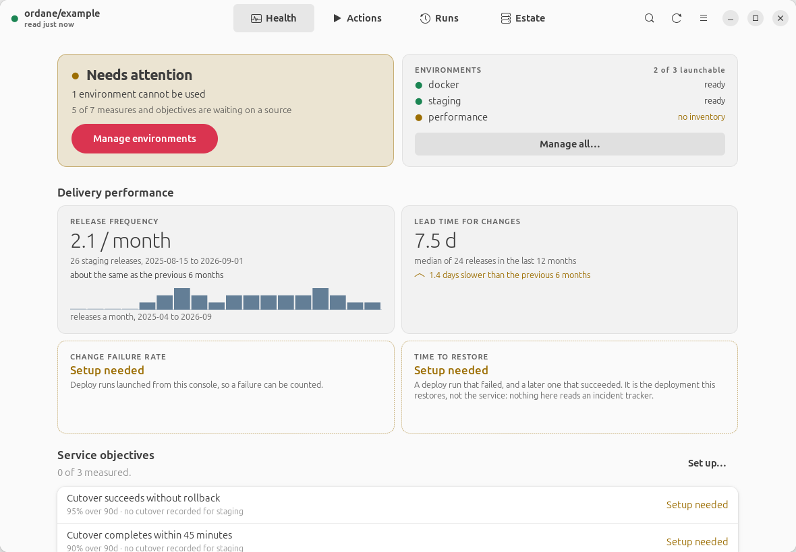
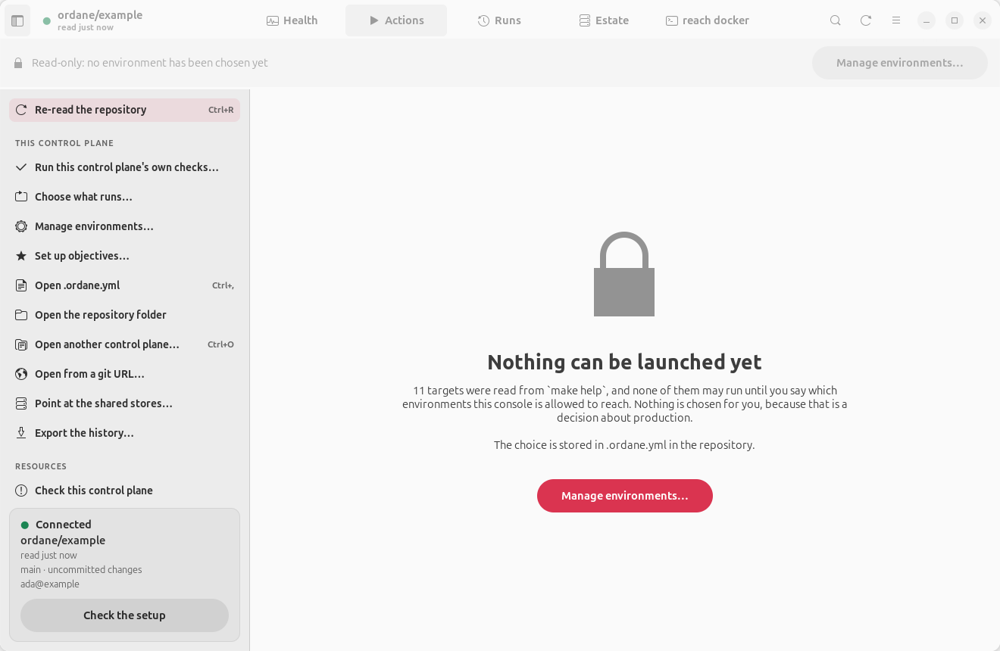

# Ordane

A desktop console for an Ansible control plane, built with GTK 4 and libadwaita. It works whether or not you drive that control plane with a Makefile.

> [!IMPORTANT]
> This is a prototype. It has been built against a real control plane and it works, but the interfaces will move and the version number says so. Treat it as an idea with a working body of code behind it rather than something to depend on.

## The problem

Plenty of teams deploy from a control plane repository: some playbooks, an inventory per environment, and often a Makefile wrapped around them. It works, and it has one large hole in it.

There is no memory. Somebody runs `make deploy`, output scrolls past, the terminal gets closed. The only record it happened is what that person remembers. Ask how often you release, how long a cutover takes, or whether the last one worked, and there is nowhere to look. The knowledge lives in whoever was on shift.

And `make` is a sharp interface for something that reaches production. A mistyped variable becomes a shell command on a remote host. A target name one letter out is a different outage. Nothing shows you what is about to run, nothing stops you running it against the wrong environment, and nothing writes down that you did.

The usual answer is a CI server or something like AWX: a service to install, keep running, authenticate against and maintain. That is a lot of machinery to acquire a deployment history, and it moves the thing that deploys away from the repository that describes it.

Ordane is the smaller answer. It reads your repository as it already is, shows you the exact command before it runs, runs it, streams the output, and keeps the record. No server, no daemon, no database, nothing to authenticate against. Your repository stays the source of truth, and whatever you were typing before still works exactly as it did.

If there is a Makefile it drives that, reading the targets out of `make help`. If there is not, your playbooks are the catalogue and it runs `ansible-playbook` itself. Neither shape has to change to be driven from here.

> [!NOTE]
> You do not need anything running to try it. Every view but one reads files on this machine, so it has something to show the moment you point it at a control plane. Where a number is missing it tells you what would fill the gap instead of printing a zero.

```bash
make demo
```

That opens the console against a control plane that reaches nothing, so you can click on anything without consequences. It seeds its own history first: ninety days of deploys, two of which failed, so the delivery measures and objectives have something real to compute from instead of four cards saying `Setup needed`. That history lives in `.demo-state/` and is rebuilt each time, and nothing you actually deploy with is touched. Then:

```bash
ordane --repo ~/control-plane
```



## Contents

- [The problem](#the-problem)
- [What it is for](#what-it-is-for)
- [Documentation](#documentation)
- [Will it work with your control plane?](#will-it-work-with-your-control-plane)
- [The one rule](#the-one-rule)
- [Install](#install)
- [Nothing runs until you say so](#nothing-runs-until-you-say-so)
- [Everywhere else](#everywhere-else)
- [Requirements](#requirements)
- [Not built yet](#not-built-yet)

## What it is for

A control plane like this has no memory. Somebody runs `make deploy`, the output scrolls past, the terminal gets closed, and the only record it happened is whatever that person remembers. Ask how often you release, or how long a cutover takes, and there is nowhere to look.

Ordane keeps that record: every run, the exact command, what Ansible reported, and how long it took. The delivery measures on the Health view are computed from it and from your release history. Where a measure has no source it says so instead of showing zero, because a backfilled figure makes an absence look like a measurement.

The other reason is that `make` is a risky interface for something that reaches production. A mistyped variable becomes a shell command on a remote host, and a target name one letter out is a different outage. So parameters are allow-listed instead of escaped, the exact command is shown before anything runs, and nothing can be launched at all until you have named the environments this console is allowed to reach.

## Documentation

| | |
|---|---|
| [From nothing to a deploy](docs/from-nothing.md) | You have no playbooks and no Ansible experience. Start here |
| [Getting started](docs/getting-started.md) | You already have a control plane. Point Ordane at it |
| [User guide](docs/user-guide.md) | Every view, every key, in plain words |
| [Configuration](docs/configuration.md) | `.ordane.yml`, key by key |
| [Architecture](docs/architecture.md) | One engine, three front ends, and how a change gets made |
| [The example control plane](examples/control-plane/README.md) | A small one that reaches nothing, so you can click anything |
| [The fleet example](examples/fleet/README.md) | A bigger one whose runs reach fourteen containers and change them |
| [Security](SECURITY.md) | The model, and what it makes load-bearing |
| [Contributing](CONTRIBUTING.md) | The gate, and where a change goes |

## Will it work with your control plane?

Yes, and it does not need a Makefile. Point it at a repository and run:

```bash
ordane init --repo ~/your/control-plane
```

That writes a starting `.ordane.yml` describing what it actually found, and tells you the one thing left to decide.

If there is no Makefile, Ordane drives `ansible-playbook` directly. The targets are your playbooks, named by the first play in each, the environments are your inventory directories, and a run is `ansible-playbook -i <inventory> <playbook>`. The only file it ever writes into your repository is its own configuration; your playbooks are read and never edited.

Where there is a Makefile, that wins. Targets are looked for in three places, in order, and the first one to answer is used:

| Source | What it is |
|---|---|
| The `Targets:` block `make help` prints | The dialect this was written against |
| The two columns `make help` prints | What every `grep '## '` help target produces |
| `target: ## description` in the Makefile | The convention those help targets read in the first place, so a repository with no `help` target still works |

Environments work the same way: the block `make help` prints, then `inventory/*` and `inventories/*` on disk, and finally, for a control plane with no environments at all, a single stand-in. That stand-in still has to be allowed before anything runs, and it adds no variable to the command.

`ordane doctor` tells you which source answered. It also catches a mismatch that is otherwise silent: if the console assigns `environment=` to a Makefile that reads `$(env)`, nothing fails. The run just goes to the default and says nothing about it.

## The one rule

The files on disk are the source of truth. The console keeps no registry of its own.

| It needs | It reads |
|---|---|
| The action list | `make help` |
| The environments | the environment block `make help` already prints |
| The playbooks | the globs in `.ordane.yml` |
| The choice lists | `patches/*.patch`, the inventory, the release directory |
| Release history | `docs/dora/history.csv` |
| Deployment events | the DORA event log |

Write a `## target: description` line above a recipe and it appears in the console. There is nothing to register and nothing to keep in step.

## Install

Three ways, and `make install` is the one for working on it:

```bash
make install
```

That puts a wrapper in `~/bin` which runs this source tree through `uv`, plus a desktop entry and icon under `~/.local/share` so it appears in your launcher. There is only one copy of the code: edit it here and reinstall, and never edit the installed file.

`ordane` with no argument reopens the last control plane you opened, which is what the launcher entry runs.

A Debian package, if you would rather install it properly:

```bash
make deb && sudo apt install ./dist/ordane_*_all.deb
```

It depends only on what the desktop and the engine actually import: `python3-gi`, `python3-yaml` and the GTK typelibs, and leaves the browser front end's dependencies out. `ordane serve` then tells you what is missing rather than failing with a traceback.

Or a flatpak:

```bash
make flatpak && flatpak run com.kingletas.Ordane
```

The flatpak runs `make`, `ansible` and `git` **on the host** through `flatpak-spawn`, because that is where your control plane and your ssh keys are. It asks for `--filesystem=home` and `--talk-name=org.freedesktop.Flatpak` to do it. Those are large permissions and they are the honest ones for an application whose job is running commands you already run.

The desktop app needs GTK 4 and libadwaita from your distribution. On Ubuntu that is `python3-gi gir1.2-gtk-4.0 gir1.2-adw-1`. `make venv` builds the virtualenv with `--system-site-packages` so it can see them. If they are missing, the console tells you and points you at the terminal front end instead of dying with an import error.

## Nothing runs until you say so

A control plane the console has never been configured for is read-only. Every environment reaches real hosts, so an empty allow list is the state it deliberately starts in, not a step somebody forgot.



Manage environments… lists what `make help` found, tells you which ones cannot be used and why, and writes the single line that decides it. Every comment in the file stays exactly where it was.

## Everywhere else

Everything is available in the terminal too, over the same catalogue, config, metrics and store, so the front ends cannot drift apart.

```bash
ordane doctor  --repo PATH     # what is wrong, and what to do about it
ordane status  --repo PATH     # the dashboard
ordane actions --repo PATH     # every target, grouped, with its parameters
ordane runs    --repo PATH     # what has run, newest first
ordane show last --repo PATH   # one run: its result, its failures, its output
ordane run ping --repo PATH -e docker
```

There is a web front end as well, `ordane serve`, which predates the desktop app and shares the same engine. It binds to `127.0.0.1` only; see [SECURITY.md](SECURITY.md).

## Requirements

Python 3.12 or later and `uv`, plus either `make` or `ansible-playbook` depending on what the repository needs. A `make`-driven repository needs one description per target, either printed by `make help` or written as a `## ` comment beside the target. An Ansible-driven one needs playbooks and an inventory, and nothing else.

## Not built yet

- **Editing environments themselves.** The console reads them and writes down which are allowed. It does not write your profile or inventory files, apart from the EC2 one it can build for you.
- **Availability and latency.** Both need a probe, and a probe that runs on a laptop is measuring the laptop.
- **Live host state.** What is deployed right now is read from the event log, not by asking the hosts.
- **Runs that did not come from here.** Anything launched by hand in a terminal is not recorded. That is the gap this tool exists to shrink, and it has not closed it.
