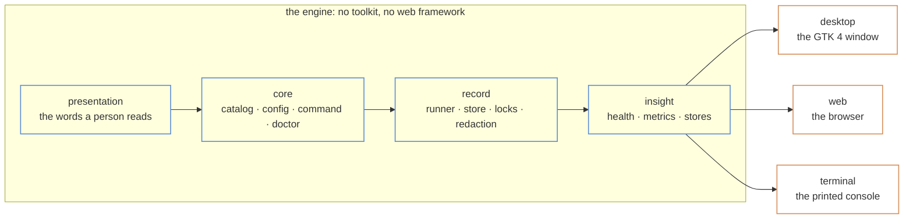

# Architecture

One engine, three front ends, and a layering rule that a test enforces.

> [!NOTE]
> A directory called `core` proves nothing on its own. `tests/test_layering.py` reads every import in the package, fails the build when one points the wrong way, and checks that the engine still imports on a machine with no GTK and no web framework installed.

## Contents

- [The one rule](#the-one-rule)
- [The line down the middle](#the-line-down-the-middle)
- [The modules worth knowing](#the-modules-worth-knowing)
- [Three things that are deliberate](#three-things-that-are-deliberate)
- [How a change gets made](#how-a-change-gets-made)

## The one rule

The files on disk are the source of truth. The console keeps no registry of its own.

| It needs | It reads |
|---|---|
| The action list | `make help` |
| The environments | the environment block `make help` already prints |
| The playbooks | the globs in `.ordane.yml` |
| The choice lists | `patches/*.patch`, the inventory, the release directory |
| Release history | `docs/dora/history.csv` |
| Deployment events | the DORA event log |

Because nothing is registered, nothing can fall out of step. Rename a target in the Makefile and it is renamed in the console at the next refresh, and the doctor points at the config entry that still uses the old name.

It also copes with more than one way of writing a Makefile. Targets are looked for in the `Targets:` block `make help` prints, then in the two columns it prints, then in `target: ## description` comments in the Makefile itself, so a repository with no `help` target still works. Environments follow the same order: the block, then the inventory directories, then a single stand-in if there are none. The catalogue records which of those actually answered, and every front end can show it, because a repository being read differently from how its owner expects is miserable to debug from outside.

## The line down the middle



Read it downwards. Each layer may import the ones above it and nothing else. A front end may reach into any of the four; none of the four knows a front end exists.

That is why a layer that judges something cannot wire up a button to fix it. When `health.py` finds a problem it names the remedy that applies, like `choose-environments`, and each front end maps that name onto whatever it can actually do. If a front end has no way to act on it, the finding simply arrives without a button.

Everything above the line is plain Python with no toolkit in it, and the three front ends read it instead of reimplementing it. So they cannot disagree: a measure with no data is missing in all three, groups come out in the same order in all three, and a run's outcome is described by the same word in all three.

`language.py` is the other half of that. Every identifier a person can see, whether a danger level, a run state or the key of a measure, has one English name and one sentence explaining it, in that file, read by all three.

## The modules worth knowing

| Layer | What it owns | May import |
|---|---|---|
| `presentation/` | `language`, `text`, `ansi`: the words, and the rendering primitives | nothing in this package |
| `core/` | `catalog`, `config`, `allowlist`, `command`, `search`, `doctor`, `recent`, `repository`, `starter`: reading the repository and deciding what may run | `presentation` |
| `record/` | `store`, `runner`, `summary`, `dora`, `redact`: running things and keeping what happened | `presentation`, `core` |
| `insight/` | `metrics`, `health`, `runs`, `relaunch`, `dataset`, `export`: what the record means, which parts of it somebody is asking about, and the shapes another store reads it in | the three above |
| `desktop/` · `web/` · `terminal/` | One package per front end | all of the above, never each other |

Those directory names are checked rather than decorative. `test_layering.py` reads every module's imports and fails on one that crosses a line, and it starts a fresh interpreter to confirm that importing the engine pulls in neither GTK nor a web framework. That check is what moved the *is GTK installed* probe out of the doctor and into the desktop package: the engine should not be asking a question only a front end can answer.

## Three things that are deliberate

Parameters are allow-listed, not escaped. Several make variables end up in a shell on a remote host. `argv` is always a list, no string is ever handed to a shell, and a value outside its declared choices is refused. So is any value carrying a shell metacharacter, whatever the choices say.

A measure with no source says so, and never reports zero. Everything in `metrics.py` carries a `blocked` field for this, and `health.py` gathers those into a *Not measured* section so a gap cannot pass for a good number.

Instrumentation never fails a run. A deployment event that cannot be written is reported, not raised. Losing a release because the log was unwritable would be a worse trade than losing the log.

## How a change gets made

```bash
make check
```

Ruff and the unit suite. This is what a commit has to pass.

```bash
make smoke
```

This one drives the real window against the example control plane. It opens it, walks the pages, searches, opens the launch form, starts a run and follows it to the end, opens every dialog, turns the allow list off and on again, and writes a PNG of each view into `docs/images/`. You cannot review a window by reading its source, and a widget that has moved is invisible to every other kind of test.

It works on a copy in a temporary directory, since it edits the allow list and records runs.

### Three questions before writing anything

1. **Which front end does this belong in?** If the answer is all three, it belongs above the line and the front ends read it.
2. **Is there a word for this that a person would use?** If somebody will read the value, put the word in `language.py` and not in a template.
3. **What does this look like when the data is missing?** Every view here has an empty state that teaches instead of apologising, and a measure that cannot be sourced says what it needs.
